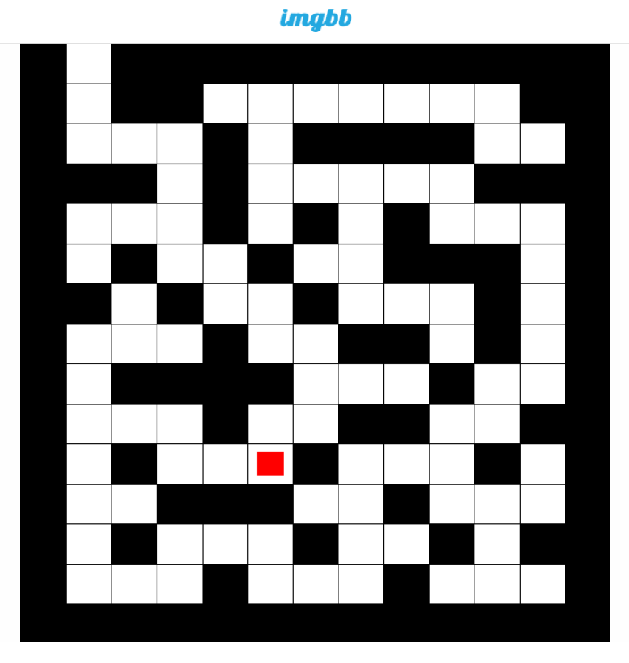

 <h1> TwitchGameBot </h1> 

 Game chat bot for Twitch streaming platform.

 <h1>  Information </h1> 

The bot allows you to conduct a "duel" between two viewers. The essence of games is to generate and visualize a random maze with a riddle, and players need to answer correctly faster than the opponent

 <h1>  Install/Setting </h1> 

For the bots to work, you need to configure the class Setting.cs 

+ channelName - The name of the twitch channel on which the bot will work
+ twitchClient_ClientName - Bot account name
+ twitchClient_OauthToken -   authorization key. For example, you can get here https://twitchapps.com/tmi/ (Or get it in other ways)
+ twitchApi_ClientId , twitchApi_AccessToken - Application authorization data, as an example, can be taken here  https://twitchtokengenerator.com/
+ ibbApiKey - hosting api key for uploading pictures of the game https://api.imgbb.com/

# Discord/Support
You can contact me by mail torretoadv@gmail.com
